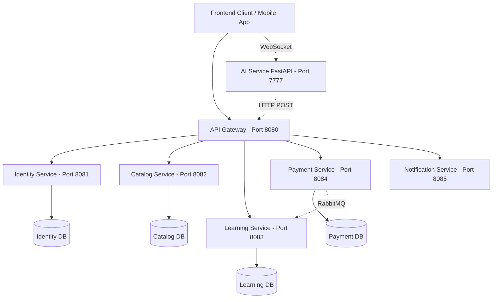

# ⚙️ St3pLearn - Backend Microservices Architecture

> **Hệ thống Microservices Backend phân tán cho Nền tảng Học tiếng Anh & Ôn luyện Chứng chỉ (Spring Boot + Spring Cloud Gateway + PostgreSQL + RabbitMQ)**

---

## 📖 Giới thiệu (Overview)

**St3pLearn Backend** được thiết kế theo kiến trúc **Microservices** hiện đại, mở rộng linh hoạt và độc lập dữ liệu. Hệ thống đảm bảo hiệu năng cao, khả năng chịu tải vượt trội cho các tác vụ tính toán tiến độ học tập, chấm điểm bài thi trắc nghiệm tức thì, thuật toán ôn tập từ vựng lặp lại ngắt quãng (Spaced Repetition) và xử lý thanh toán trực tuyến.

---

## 🏗 Kiến trúc & Các Dịch vụ (Microservices Structure)



### 🧩 Chi tiết Các Microservices:

| Service Name | Port | Chức năng chính (Key Responsibilities) |
| :--- | :---: | :--- |
| **`api-gateway`** | `8080` | Cổng API tập trung, điều hướng Request, xác thực Header & Rate Limiting. |
| **`identity-service`** | `8081` | Đăng ký, Đăng nhập, Tạo JWT Token, Phân quyền RBAC (`STUDENT`, `TEACHER`, `ADMIN`), Quản lý Hồ sơ người dùng. |
| **`catalog-service`** | `8082` | Quản lý Khóa học, Chương học, Bài học, Upload tệp PDF/Video trực tiếp lên Server, Quản lý Danh mục & Thẻ Tag. |
| ****`learning-service`** | `8083` | Quản lý Ghi danh (Enrollments), Tiến độ học tập, Hệ thống Flashcard Từ vựng Spaced-Repetition, Bài thi Trắc nghiệm & Cấp Chứng chỉ. |
| **`payment-service`** | `8084` | Tích hợp Cổng thanh toán VNPay, Đơn hàng Checkout, Mã giảm giá Coupon, Xử lý Yêu cầu Hoàn tiền. |
| **`notification-service`**| `8085` | Nhận Event qua RabbitMQ, phát thông báo thời gian thực & tạo báo cáo vi phạm. |
| **`ai-service`** | `7777` | Dịch vụ AI (FastAPI) đàm thoại tiếng Anh qua WebSocket, sinh giọng nói AI (Edge TTS), tạo gợi ý đối đáp (Hint) và phân tích sửa lỗi sai ngữ pháp qua local LLM (Ollama). |

---

## 🛠 Công nghệ & Thư viện (Tech Stack)

* **Java & Framework:** Java 17 / 21, Spring Boot 3.x, Spring Cloud (Gateway, Eureka / OpenFeign)
* **Database:** PostgreSQL (Mỗi service sở hữu Database riêng biệt - Database per Service pattern)
* **ORM:** Spring Data JPA, Hibernate (Cấu hình `@JsonIgnoreProperties` xử lý ByteBuddy Proxy)
* **Message Broker:** RabbitMQ (Xử lý sự kiện bất đồng bộ khi hoàn tất thanh toán & ghi danh)
* **Xác thực:** Spring Security, Nimbus JOSE JWT, Custom `@RequireRole` Annotation
* **Build Tool:** Maven (Multi-module project)

---

## ⚡ Hướng dẫn Cài đặt & Khởi chạy (Setup & Running)

### 1. Yêu cầu Tiền đề (Prerequisites)
* **Java Development Kit (JDK):** `>= 17`
* **PostgreSQL:** `>= 14` (Tạo các CSDL: `identity_db`, `catalog_db`, `learning_db`, `payment_db`)
* **RabbitMQ Server:** Đang chạy tại `localhost:5672` (nếu dùng tính năng Event-driven)

### 2. Cấu hình Cơ sở dữ liệu (`application.yml`)
Cập nhật thông tin kết nối PostgreSQL tại file `application.yml` trong từng service:
```yaml
spring:
  datasource:
    url: jdbc:postgresql://localhost:5432/<database_name>
    username: postgres
    password: <your_password>
```

### 3. Biên dịch Project với Maven
Tại thư mục gốc `BE/st3p-learn`:
```bash
mvn clean package -DskipTests
```

### 4. Chạy các Microservices
Lần lượt khởi chạy các Service theo thứ tự đề xuất:
1. `identity-service` (Port 8081)
2. `catalog-service` (Port 8082)
3. `learning-service` (Port 8083)
4. `payment-service` (Port 8084)
5. `api-gateway` (Port 8080)
6. `ai-service` (Port 7777 - Dịch vụ Python FastAPI, xem hướng dẫn chạy chi tiết trong [ai-service/README.md](file:///d:/DATT_CNPM/BE/st3p-learn/ai-service/README.md))

Hoặc chạy trực tiếp file `.jar` từng service Spring Boot:
```bash
java -jar api-gateway/target/api-gateway-0.0.1-SNAPSHOT.jar
```

---

## 🔌 API Gateway & AI Service Endpoints chính

* **Xác thực & Người dùng:** `http://localhost:8080/api/auth/*`, `http://localhost:8080/api/users/*`
* **Khóa học & Bài học:** `http://localhost:8080/api/courses/*`
* **Bài thi & Từ vựng:** `http://localhost:8080/api/learning/*`, `http://localhost:8080/api/learning/student/exams`
* **Thanh toán & Hoàn tiền:** `http://localhost:8080/api/payment/*`
* **Phòng nói chuyện AI (WebSocket):** `ws://localhost:7777/api/ai/speaking/ws`

---

## 📜 Giấy phép (License)
Dự án thuộc bản quyền của **St3pLearn Team**.
